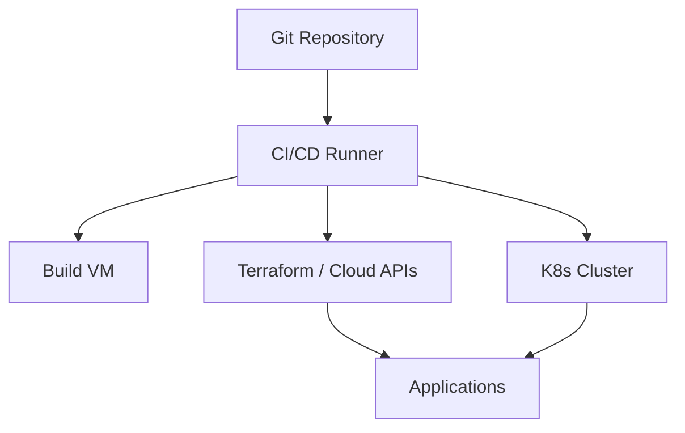
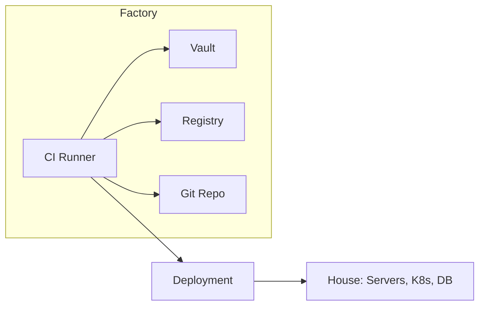
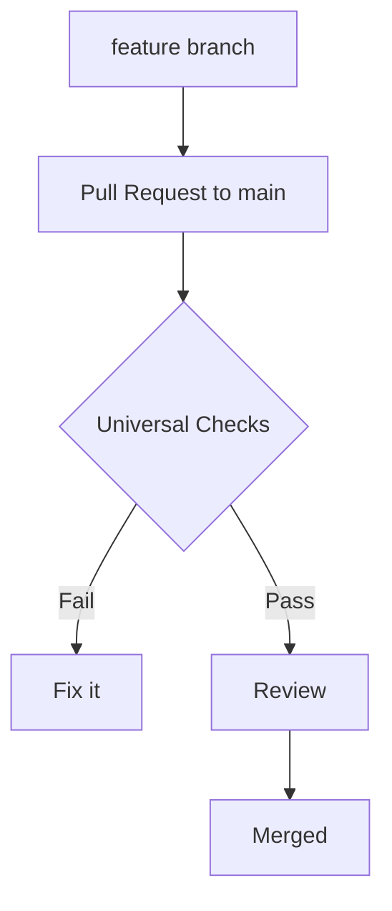
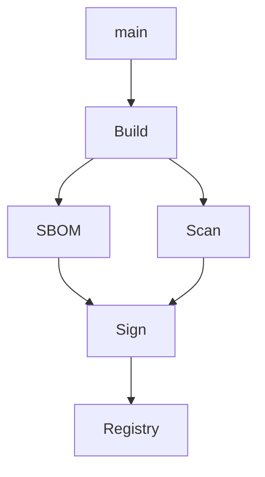
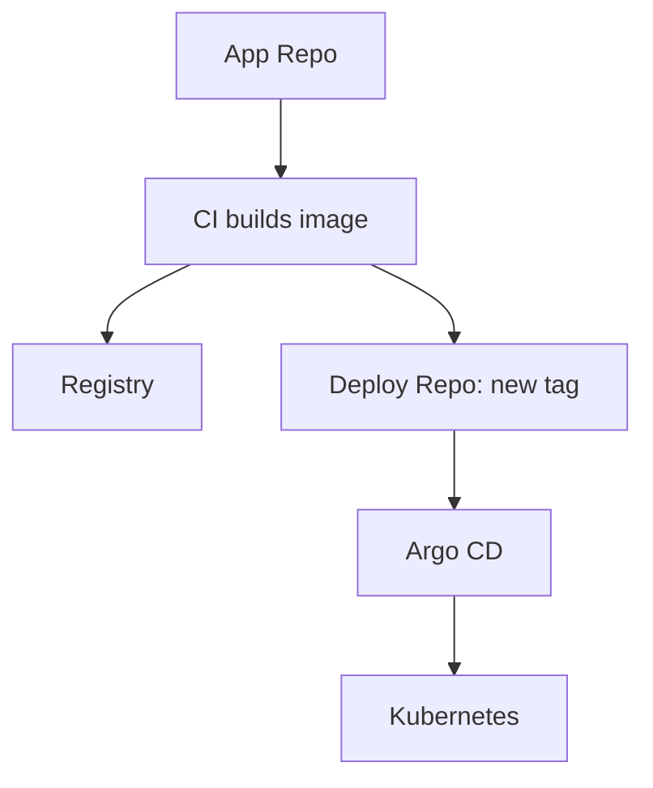
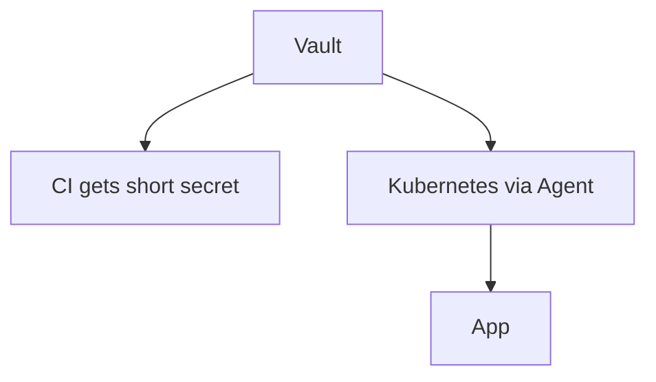
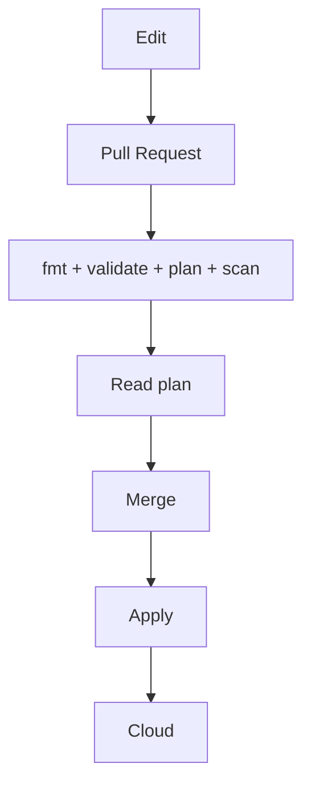
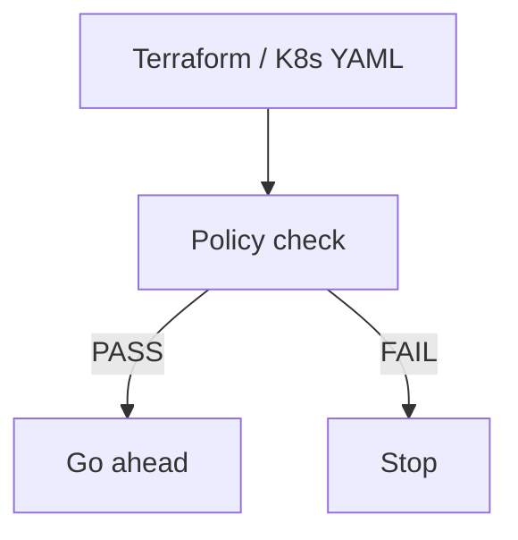
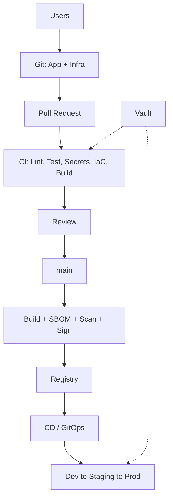

# Designing a Production-Grade CI/CD Pipeline: From Git Commit to Secure Deployment

*A simple guide for anyone who pushes code and hopes nothing breaks. Works for AWS, Azure, GCP, OpenStack, VMware, bare metal and Kubernetes.*

> Think CI/CD is just Code to Build to Deploy? Real CI/CD asks: how does the runner connect, how is it checked, what is tested, what is built, how is it kept safe, where is it kept, how is it released, and who can prove what happened?

It was 2 AM. The pipeline showed green. Still production was down. It had deployed an old `latest` image with a password written inside the code, using full root access, and nobody knew who did what. Green did not mean safe.

This blog explains CI/CD like a story. Simple words. Real examples.

## Inside This Blog

1. Look at Infrastructure First
2. Keep Factory and House Separate
3. How the Runner Talks to Servers
4. SSH the Safe Way
5. Network and Login Are Different
6. Do Not Give CI Full Power
7. Config and Secrets Are Different
8. One Universal PR Gate for Code and IaC
9. Build One Time, Use Everywhere
10. Know What Is Inside Your Image
11. Let Kubernetes Pull
12. Keep Secrets in Vault
13. Show Plan Before You Apply
14. Let Rules Check Automatically
15. Who Gets Mail When Pipeline Fails or Passes
16. Full Picture in One Place
17. Your CI/CD Should Be Portable, Working, Deletable, Replaceable

## 1. Look at Infrastructure First

Do not start with YAML. Start with where your runner lives. GitHub Actions, GitLab Runner, Jenkins, all are just workers. Ask what they really need to touch.



I saw one small team draw this on paper for 30 minutes. Later adding a new server took only 10 minutes. Easy life.

Another team opened port 22 to the full internet just for a demo. They forgot to close it. A stranger installed miners inside. The bill became huge and nobody knew who opened the port.

## 2. Keep Factory and House Separate

Factory is where you build: runners, Jenkins, scanners. House is where people live: app, database, Kubernetes.



One team kept them separate. Their build machine got full. Prod still worked. They fixed it slowly with tea.

Another team kept Jenkins and prod on the same machine to save money. A test filled the disk. Both build and prod died together on sale day. Small saving, big loss.

## 3. How the Runner Talks to Servers

Use the right tool for the right place. Like you walk to the shop, you take a train for far cities.

| Where | Use This |
|---|---|
| Linux VMs | SSH, Ansible |
| Kubernetes | kubectl, Helm, Argo CD |
| Cloud | Terraform with cloud API |
| Windows | WinRM, HTTPS |

One student team used Ansible for VMs and Argo CD for Kubernetes. Clear and calm.

Another team tried to fix Kubernetes by SSHing into nodes and restarting docker. It worked for one day. Next day Kubernetes moved the app to another node and the problem came back during a live demo.

## 4. SSH the Safe Way

If you need SSH, make a fresh key only for CI.

```bash
ssh-keygen -t ed25519 -C "cicd-runner"
```

Private key stays in CI secrets. Public key goes to the server.

```text
CI has private key -> server checks public key -> login as deploy-user
```

One team did this neatly. When a member left, they removed one key in 10 minutes. Done.

One student pushed his private key to GitHub by mistake. Bots stole it in seconds. Someone started costly servers in his AWS account. Morning brought a shocking bill.

## 5. Network and Login Are Different

Two questions. Can you reach the server? And does the server trust you? Both must be yes.

```text
CI Runner -> firewall check -> server:22 -> key check -> in
```

| What | Example |
|---|---|
| From | CI Runner |
| To | Prod VM |
| Port | SSH 22 |
| Way | key from secret store |
| Network | private only, no public IP |

One team wrote this down. When deploy failed they found the firewall issue in 5 minutes.

Another team spent a full day changing keys. Real problem was only that VPN was off. They checked the wrong thing all day.

## 6. Do Not Give CI Full Power

Never do this:

```bash
deploy-user ALL=(ALL) NOPASSWD: ALL
```

That is giving full root. Instead allow only two or three needed commands:

```bash
deploy-user ALL=(ALL) NOPASSWD: /bin/systemctl restart myapp, /usr/local/bin/deploy-app
```

Think hotel room card. It should open one room, not all rooms.

One team gave only restart permission. A leaked token could do almost nothing. They just changed the token and relaxed.

Another team gave CI full root. A small typo in a script deleted important files on prod. Shop stayed closed for a full day. All for “easy permissions.”

## 7. Config and Secrets Are Different

See this file:

```bash
APP_NAME=payment-service
APP_PORT=8080
LOG_LEVEL=INFO
DATABASE_HOST=db.internal
DATABASE_PASSWORD=super-secret-password
API_TOKEN=super-secret-token
```

First lines are normal info. Last two are secrets. Do not mix them.

Keep normal info open:

```yaml
appName: payment-service
appPort: 8080
logLevel: info
```

Keep secrets locked:

```yaml
dbPassword: from vault
apiToken: from vault
```

One team kept it split. To change log level they just edited config in 2 minutes. No stress.

Another team put the DB password in Git. An old member still had the copy. Later data leaked. Police and news came in. Simple mistake, huge pain. And remember, just putting everything in env vars does not make it safe. Logs can leak them easily.

## 8. One Universal PR Gate for Code and IaC

Do not make two different gates, one for app code and one for Terraform. Make one gate for everything. Code, Terraform, Helm, Dockerfiles, Ansible, all go through the same door. Think of PR checks like airport security. Slow but needed before flight. Everyone stands in the same line.



One PR runs all of this together:

| Check | For Code | For IaC and Images |
|---|---|---|
| Format | black, prettier, gofmt | terraform fmt -check, yaml lint, helm lint |
| Lint | ruff, eslint, golangci-lint | tflint, kube-linter, hadolint for Dockerfile |
| Security in code | Semgrep, CodeQL, SonarQube | Checkov, tfsec, trivy config scan |
| Libraries and vulns | npm audit, pip audit, dependabot | trivy fs, grype on plan, base image scan |
| Secrets | gitleaks, trufflehog | same, plus no password in tf vars |
| Test | unit tests, pytest, jest | terraform validate, terraform plan, conftest policy |
| Build | docker build test, go build, npm build | docker build, helm template, ansible dry run |

Example run in one pipeline:

```bash
# code side
ruff check .
gitleaks detect --no-git
pytest -q
trivy fs --severity HIGH,CRITICAL .

# IaC side in same PR
terraform fmt -check
terraform validate
terraform plan -out=tfplan
checkov -d . --framework terraform
conftest test tfplan.json
```

Note: PR build is only for testing. Throw it away. Real build happens only from main.

```text
PR -> build to test + scan -> throw
main -> real build -> SBOM -> scan -> sign -> keep
```

One junior pushed an AWS key in app code by mistake. Same PR also made a public S3 bucket in Terraform. The single gate stopped both in seconds. Two problems fixed before lunch.

Another team kept code checks but skipped IaC checks because “Terraform is just infra.” That “just infra” opened the database to the internet. App code was perfect, infra was open. Hackers did not care which part was perfect.

Another team merged a “small CSS fix” directly without checks. It had a bad library with a known vuln inside. No vuln scan ran on PR, so it went live and stole user data. App got removed from the store. One skipped scan, weeks of sorry posts.

## 9. Build One Time, Use Everywhere

After merge, run all checks again from main, then build. Yes, again. PR tested the idea. Main is the truth. So lint, test, secret scan, vuln scan, IaC scan all run again, then the real build starts. This catches mix issues when two PRs merge together.

Then tag it clearly:

```bash
docker build -t myapp:1.4.2 -t myapp:a81c92f .
docker push myapp:1.4.2
```

Do not trust `latest`. It tells nothing. Version plus commit id tells everything.



One team used the same image in dev, staging and prod. Bug came in prod, they opened the same image in staging, found it fast.

Another team built separately for each place. Staging worked, prod crashed on sale day because builds were slightly different. Same code, different result. Bad day.

## 10. Know What Is Inside Your Image

What is inside your docker image right now? Many hidden libraries. You need a list. That list is called SBOM. Formats are CycloneDX and SPDX.

```bash
syft myapp:1.4.2 -o cyclonedx-json > sbom.json
grype myapp:1.4.2 --fail-on critical
cosign sign --key cosign.key myapp:1.4.2
```

Simple idea: SBOM is the menu, scanning checks if food is bad, signing proves who cooked it.

```text
Source to Build to List to Scan to Sign to Store to Deploy
```

One team had SBOM ready. When a big new bug came, they searched in 2 minutes and fixed only 3 services. Nobody panicked.

Another team had no list. Same bug came. They spent 3 weeks just finding where the bad library was. By then hackers had already entered.

## 11. Let Kubernetes Pull

For VMs, SSH is fine. For Kubernetes, GitOps is best. CI builds the image and updates Git. Argo CD sees Git and updates Kubernetes. CI never touches the cluster directly.



One team had a bad release at night. They just reverted Git from phone. Argo fixed it in a minute. They slept well.

Another team kept full cluster keys in CI. The key leaked in logs. Strangers ran miners inside the cluster. Prod slowed down and bill tripled. Fixing took a full weekend.

## 12. Keep Secrets in Vault

CI variables are okay for 2-3 secrets. For many apps you need Vault.



App never knows the main password. It gets a short password for one hour, then a new one.

```text
Old: one password for years, shared in chat
New: new password every hour, auto change
```

One team used short passwords. A laptop was stolen. The password inside died in 40 minutes. No fear.

Another team used the same DB password for 3 years. It was in docs, chat, CI, everywhere. An angry ex-member logged in from home and deleted data. No record of who did it. Shop closed for a week.

Small note: sealed means Vault is locked. Unsealed means open and ready. It can open with key pieces or cloud help.

## 13. Show Plan Before You Apply

Do not click in console. Write infra as code:

```text
terraform/
  providers.tf
  variables.tf
  main.tf
  outputs.tf
  modules/
```

Flow is simple:



One team read the plan carefully. Plan said “will delete database.” They stopped it. Saved all data with one comment.

Another engineer typed `count = 50` instead of `5` and applied from laptop. Fifty costly machines started. Bill shocked everyone. State file also broke because laptop slept mid-work. Three days of cleanup.

And never write passwords in code:

```hcl
# bad
password = "MySuperSecretPassword"

variable "db_password" {
  type = string
  sensitive = true
}
```

Remember `sensitive` only hides logs, it still stays in state file. So keep state file safe in remote backend with lock.

## 14. Let Rules Check Automatically

People forget rules. Machines do not. Write rules once:

* no public database
* no open SSH to world
* no secret in code
* must have CPU and memory limits



Tools: OPA, Conftest, Checkov, tfsec, Kyverno. Start with 5 simple rules.

One new member tried a risky pod. The tool stopped it politely and showed the safe way. He learned fast, prod stayed safe.

Another college cluster had no limits. One buggy app ate full CPU. All 15 student projects died during viva. Teacher saw only errors. One simple rule could have saved marks.

Also send alerts to Slack and keep notes: who changed what, when, which version, where it went. If you cannot answer in 5 minutes, your records are weak.

## 15. Who Gets Mail When Pipeline Fails or Passes

Pipeline should not stay silent. Right person should get mail at right time. No spam to all.

Simple rule: fail mail goes to the person who broke it plus reviewer. Pass mail goes only when it matters, like prod deploy.

Who gets what:

| When | Mail To | What to Write |
|---|---|---|
| PR checks fail | PR author, commit author | which step failed, link to logs, how to fix |
| PR checks pass | no mail, just green tick | avoid noise |
| Main build fails | author of last merge, team lead | which commit broke main, urgent |
| Security scan finds high vuln | author plus security buddy | which library, severity, fix version |
| Staging deploy done | QA group | version ready for testing, what changed |
| Prod deploy done | full team plus owner | version live, who approved, rollback link |
| Prod deploy fails | full team plus on-call | urgent, error line, who is fixing |

One team did this well. Student broke a test at 4 PM. He got a mail in 2 minutes with failed test name and log link. He fixed by 4:30. Nobody else got disturbed.

Another team mailed everyone for every small success. 200 mails a day. People made a filter to trash all CI mails. Then real prod failure mail also went to trash. Nobody saw it for 6 hours. Too many mails means no mails.

How to do it simply:

```bash
# GitHub Actions example: mail only on failure to PR author
# uses commit author email from git log
git log -1 --pretty=format:'%ae'
```

```yaml
# GitHub Actions short idea
# on push to main: if fail, mail last committer
# on PR: comment on PR, mail author only
# on prod tag: mail team list
```

```bash
# GitLab idea: mail author on fail
# in .gitlab-ci.yml -> notify job with when: on_failure
# to: $GITLAB_USER_EMAIL, $CI_COMMIT_AUTHOR
```

```groovy
// Jenkins idea: mail to culprits, not all
// emailext to: '${CHANGES_SINCE_LAST_SUCCESS, showPaths=true}'
// or mail to: developers, culprits, requester
```

Three small tips that save life:

* Use group mails, not personal mails. Like `backend-team@college.edu`, `prod-alerts@company.com`. People join and leave, group stays.
* Never put passwords in mail body. Only give links to logs. Mails stay forever in inbox.
* For prod, mail both success and failure. For dev, mail only failure. Less noise, more action.

Also add same names to Slack or Teams if you use it. Mail for record, chat for fast action.

## 16. Full Picture in One Place

Here is all of it together:



Ten simple rules:

1. CI builds, CD releases. Keep them apart.
2. Keep everything in Git: app, Terraform, pipeline, rules.
3. Never put secrets in Git.
4. Normal info open, secrets locked.
5. No merge without green checks.
6. Same image from dev to prod.
7. Scan and sign every time.
8. Give only needed power, nothing extra.
9. Use short passwords that change often.
10. Note everything: who, what, when, where.

## The One Picture to Remember

```text
SOURCE
  to PULL REQUEST
  to CHECK
  to REVIEW
  to MAIN
  to BUILD with list, scan, sign
  to STORE
  to RELEASE with Argo CD or SSH or Terraform
  to SERVER
  to APP
  to WATCH
  to FEEDBACK
```

Three helpers always run beside it: Vault for secrets, security checks for safety, logs and alerts for watching.

One team followed this. Deploys became boring. Many deploys a day, no fear, new person ships on day two. Happy life.

Another team ignored this. Every deploy was fear. No Friday deploys, freeze before festivals, seniors awake at night, secrets in chat, nobody knows what version is live. Good people left. Users left too.

Pick Jenkins or GitHub Actions or GitLab, it does not matter. Just answer: how to connect, how to login, what to check, what to build, how to keep safe, where to keep, how to release, how to manage secrets, how to prove it.

## 17. At The End, Your CI/CD Itself Should Be Portable, Working, Deletable, Replaceable

Your app is portable. Your CI/CD should be also. Think of CI/CD like a food cart, not a fixed shop. You should be able to move it, start it, close it, change parts, anywhere.

Portable means it runs anywhere. Same pipeline on laptop, college server, AWS, Azure. No “it only works on Jenkins in my room.” Use containers for jobs, keep tools in code, no magic clicks. One team moved from GitLab to GitHub in a day because all steps were in docker images. Another team wrote pipelines only for one server. Server died, all pipelines died with it.

Working means anyone can run it and get the same result. Fresh member clones repo, runs one command, gets same build. Clear readme, sample env file, seed data. One team’s new intern deployed to dev on day one alone. Another team’s setup needed 10 calls to seniors and still failed because steps were only in someone’s head.

Deletable means you can destroy and make again without fear. Dev env for each PR, delete after merge. `terraform destroy` actually works. No leftover bills. One team made 20 test envs for a fest, deleted all next day, bill zero. Another team was scared to delete anything because nobody knew what would break. Old test servers kept running for 2 years, eating money.

Replaceable means no single tool holds you hostage. Today Jenkins, tomorrow GitHub Actions, same app. Keep build scripts outside the CI tool, use open formats like CycloneDX, OCI images. One team swapped scanners in an hour because logic was in a simple shell script. Another team wrote 500 lines inside one CI tool. To change tool meant rewriting everything, so they stayed stuck with a slow tool for years.

Simple test for you: can you delete your full dev setup today and make it again tomorrow morning with only Git plus one command? If yes, you are safe. If no, that is your next work.

Start small this week. Add secret check to one repo. Move one password to Vault. Stop using latest. Show terraform plan on PR. Make one env fully deletable and rebuildable. Small steps make it strong.
